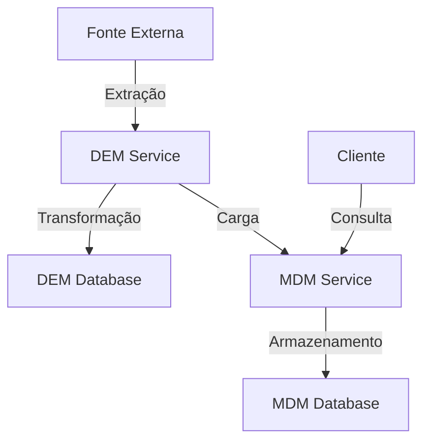

# Documentação da API - Serviços DEM e MDM

## Visão Geral da Arquitetura

O sistema é composto por dois microserviços principais:

1. **DEM (Data Entity Management)**
   - Responsável pela extração, transformação e carga (ETL) dos dados
   - Porta padrão: 8082
   - Banco de dados: PostgreSQL (demdb)

2. **MDM (Master Data Management)**
   - Responsável pelo gerenciamento dos dados mestres
   - Porta padrão: 8081
   - Banco de dados: PostgreSQL (mdmdb)

### Diagrama de Arquitetura



## Serviço DEM (Data Entity Management)

### Endpoints ETL

#### 1. Iniciar Extração e Transformação
- **Endpoint**: `POST /api/etl/start`
- **Descrição**: Inicia o processo de extração e transformação dos dados
- **Resposta**: 
  ```json
  {
    "id": "número da transação",
    "status": "RUNNING",
    "startedAt": "timestamp",
    "finishedAt": null,
    "errorMessage": null
  }
  ```

#### 2. Carregar Dados no MDM
- **Endpoint**: `POST /api/etl/load/{transactionId}`
- **Descrição**: Carrega os dados transformados no serviço MDM
- **Parâmetros**:
  - `transactionId`: ID da transação ETL
- **Resposta**: 204 No Content (sucesso)

#### 3. Listar Transações ETL
- **Endpoint**: `GET /api/etl/transactions`
- **Descrição**: Lista todas as transações ETL realizadas
- **Resposta**: 
  ```json
  [
    {
      "id": "número da transação",
      "status": "RUNNING|TRANSFORMED|LOADED|FAILED",
      "startedAt": "timestamp",
      "finishedAt": "timestamp",
      "errorMessage": "mensagem de erro (se houver)"
    }
  ]
  ```

### Fluxo de Dados ETL

1. **Extração**
   - O serviço DEM extrai dados da API externa (restcountries.com)
   - Campos extraídos: nome, código, região, sub-região, capital e população

2. **Transformação**
   - Normalização dos dados:
     - Nomes e códigos convertidos para maiúsculas
     - Remoção de espaços em branco
     - Tratamento de valores nulos
   - Validação de dados obrigatórios

3. **Carga**
   - Dados transformados são enviados para o MDM
   - Operação de upsert (inserção ou atualização)
   - Tratamento de erros e rollback em caso de falha

## Serviço MDM (Master Data Management)

### Endpoints de Países

#### 1. Listar Países
- **Endpoint**: `GET /api/countries`
- **Descrição**: Lista países com filtros opcionais
- **Parâmetros Query**:
  - `name`: Filtro por nome do país
  - `code`: Filtro por código do país
- **Resposta**:
  ```json
  [
    {
      "id": "número",
      "name": "nome do país",
      "code": "código",
      "region": "região",
      "subregion": "sub-região",
      "capital": "capital",
      "population": "população"
    }
  ]
  ```

#### 2. Buscar País por ID
- **Endpoint**: `GET /api/countries/{id}`
- **Descrição**: Busca um país específico pelo ID
- **Resposta**: Objeto país ou 404 Not Found

#### 3. Criar País
- **Endpoint**: `POST /api/countries`
- **Descrição**: Cria um novo país
- **Body**:
  ```json
  {
    "name": "nome do país",
    "code": "código",
    "region": "região",
    "subregion": "sub-região",
    "capital": "capital",
    "population": "população"
  }
  ```
- **Validações**:
  - Nome e código únicos
  - Campos obrigatórios

#### 4. Atualizar País
- **Endpoint**: `PUT /api/countries/{id}`
- **Descrição**: Atualiza um país existente
- **Body**: Mesmo formato do POST
- **Validações**: Mesmas do POST

#### 5. Excluir País
- **Endpoint**: `DELETE /api/countries/{id}`
- **Descrição**: Remove um país
- **Resposta**: 204 No Content (sucesso)

#### 6. Upsert em Lote
- **Endpoint**: `POST /api/countries/upsert/batch`
- **Descrição**: Cria ou atualiza múltiplos países
- **Body**: Array de objetos país
- **Resposta**: Array de países atualizados

### Modelo de Dados

#### País
```json
{
  "id": "Long",
  "name": "String",
  "code": "String",
  "region": "String",
  "subregion": "String",
  "capital": "String",
  "population": "Long"
}
```

## Tratamento de Erros

### DEM Service
- **400 Bad Request**: Parâmetros inválidos
- **500 Internal Server Error**: Erros internos do servidor

### MDM Service
- **400 Bad Request**: Dados inválidos ou duplicados
- **404 Not Found**: Recurso não encontrado
- **500 Internal Server Error**: Erros internos do servidor

## Integração de Novos Domínios

Para integrar um novo domínio ao sistema, siga estas etapas:

1. **No DEM Service**:
   - Criar nova entidade de transformação
   - Implementar lógica de extração específica
   - Adicionar regras de transformação
   - Configurar mapeamento para o MDM

2. **No MDM Service**:
   - Criar nova entidade de domínio
   - Implementar repositório e serviço
   - Adicionar endpoints REST
   - Configurar validações específicas

3. **Integração**:
   - Atualizar cliente MDM no DEM
   - Implementar lógica de carga específica
   - Adicionar testes de integração

## Documentação Interativa

Ambos os serviços possuem documentação Swagger UI disponível em:
- DEM: http://localhost:8082/swagger-ui.html
- MDM: http://localhost:8081/swagger-ui.html 